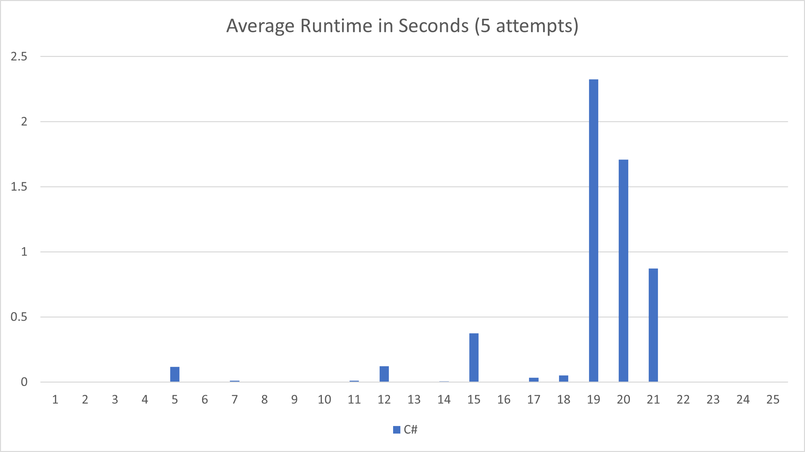

# Advent of Code 2021
Solutions to [Advent of Code 2021](https://adventofcode.com/2021)

We're doin' it again!

This year I'm hoping to lower the time committment by solving first in C#. I will likely end up solving some in other
languages later and will track which solutions I've done, using the chart below.

## Progress

|      |1|2|3|4|5|6|7|8|9|10|11|12|13|14|15|16|17|18|19|20|21|22|23|24|25|
|------|-|-|-|-|-|-|-|-|-|--|--|--|--|--|--|--|--|--|--|--|--|--|--|--|--|
|**C#**|🌟|🌟|🌟|🌟|🌟|🌟|🌟|🌟|🌟|🌟|🌟|🌟|🌟|🌟|🌟|🌟|🌟|🌟|🌟|🌟|🌟|🌟|🌟|🌟|🌟|

⭐ - First star completed\
🌟 - Both stars completed

## Results
I've added `output.txt` as a reference for my answers (for convenient checking while refactoring) and runtimes of my solutions.

C# - [output.txt](csharp/output.txt)

*Day 23 is currently too slow to get an average for this chart

## Environment
* Visual Studio 2019
  * [.NET 5](https://dotnet.microsoft.com/download/dotnet/5.0) / C# 9

## Links
* [Advent of Code](https://adventofcode.com)
* [Last Year's Solutions](https://github.com/efrees/adventofcode2020)